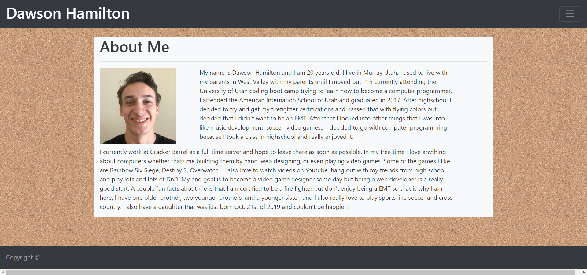
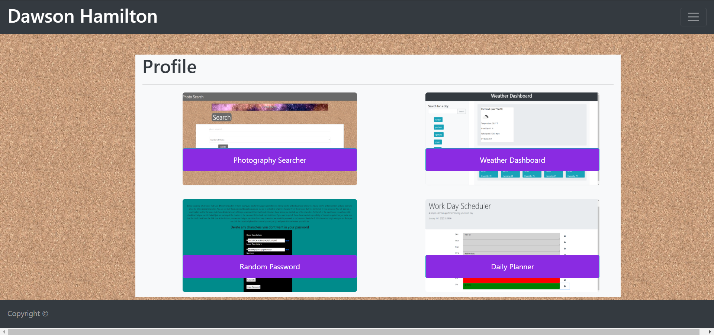
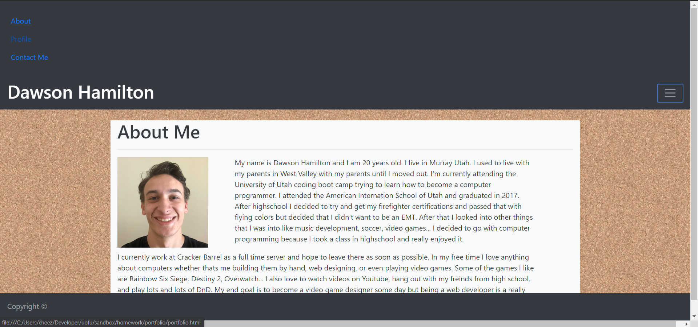

# Dawson's Profile Page
​
## Overview
​
The purpose of this application is to show you a little bit about me and what I can do with web development so far. 
​
### Gallery
​
Home:

​
Sign In:

​
Super Cool Page:

​
### Problem
​
Currently there are no problems with the code, but I would like to add things in the future
​
### Future Development
​
In the future I would like to completely redisgn the page to show off my css and javascript skills a little more, I would also like
to make the page one page instead of three that you can just scroll down to show everything off. 
​
## Tech and Features Used
​
* Bootstrap
* HTML
* CSS
​
## Technical Overview
​
1. When you first open the page up it takes you to the home screent that tells you a little bit about me. 
2. When you click on the navbar there are a few options that you will be given. 
3. If you click on the pprofile button then it will take you to my profile page, if you press the contact me button then it will take
   you too my contact page. 
4. When you get to the profile page it will show you four projects that I have worked on and the buttons will take you to those. 
5. If you click on the contact me one you will see a page that hass all my info and my resume linked to the page. 
